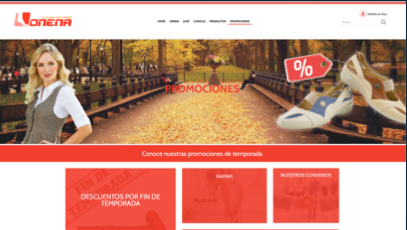

## Foodin

Solución de problemas de funcionalidad en wordpress hasta en un 90% por medio de código PHP, Javascript, HTML y CSS. Implementación de códigos de seguimiento Google Analytics, Google Search Console y Facebook pixel por medio de etiquetas en Wordpress. Migración del sitio de WordPress a ReactJs. Migración del sitio de DigitalOcean a Hostgator. Migración del sitio de hostgator a Amazon Web Service. Integración del CRM Hubspot con la plataforma en WordPress. Administración del sitio en Wordpress. Administración de la plataforma Google Workspace. Administración de la plataforma Amazón Web Service. Administración del sitio en ReactJS por medio de Amazon Web Service y la API del sitio. Creación de componenetes en ReactJS, maquetación de las páginas del sitio en reactJS en un 80%. Desde el 2021 a la fecha.

Link: [Foodin](https://foodin.mx/)

## Helply

Configuración de plugins de pago para la reservación de consultas sicólogicas por medio de zoom. Configuración de códigos de seguimiento, Gooogle Search Console, Goolge Analytics y Facebook pixel por medio de código. Configuración de woocommerce y pasarelas de pago. Configuración de google recaptcha por medio de google cloud platform. Creación de keywordresearch. 2020.

## MECI

Landing page, creada en Wordpress con Elementor, de la secretaría de relaciones exteriores para el evento Encuentro Internacional Mujeres en la Economia del Conocimiento y la Innovación, llevado a cabo en 2016 en Merida, Yucatan, México. Configuración del hosting en DigitalOcean.

## mibicicleta

Sitio web personal para posicionar palabras clave relacionadas con bicicletas. 1200 clicks en total en la busqueda. 50000 impresiones totales. Posicion media 9. CTR promedio 2.4%. 361 visitas mensuales. 37 palabras clave posicionadas. Maquetación con markdown, despliegue en netlify, creado con gohugo.io. Estructuración de la página,
keyword research, aplicación de técnicas white hat, configuración de meta tags, configuración SEO on page y off page.

Link: [MiBicicleta](https://mibicicleta.site)

## IbotForFun

Diseño y programción de un temeplate de Wordpress creado en PHP, HTML, CSS y Javascript creada para la empresa ibotforfun en Guadalajara, Jalisco, México en el año 2020. Configuración del hosting en Hostgator. Planeación de la arquitectura del sitio para el posicionamiento de palabras clave.

Link: [IbotForFun](https://edu.ibot4fun.com/)

## Pastas La Perla

Landing page con recetario echa desde cero, en wordpress, para pastas la perla de La moderna en el año 2015. Configuración del hosting en un servidor creado en DigitalOcean.

## Joe Rocket México

Configuración de woocommerce, pasarelas de pago, plugins y cambios a nivel de código en el sitio Joerocket en el año 2016.

Link: [JoeRocket](https://joerocket.mx/)

## Onena

Administración y resolución de bugs del sitio Onena echo en el framework codeigniter en el año 2015.

Link: [Onena](https://www.onena.mx/)

## Yuya

Creación desde cero del sitio web Yuya en wordpress en el año 2015.

## OnPost

Administración y solución de bugs por medio de código PHP, JavaScript, Html y CSS, en WordPress. Configuración del hosting en godaddy. Compra de dominio en GoDaddy. Keyword Research. Implementación de códigos de seguimiento, Google Search Console, Google Analytics y Facebook Pixel por medio de Google Tag Manager. Cofiguración de pasarelas de pago y woocommerce. Configuración de certificados de seguridad SSL. en el año 2018